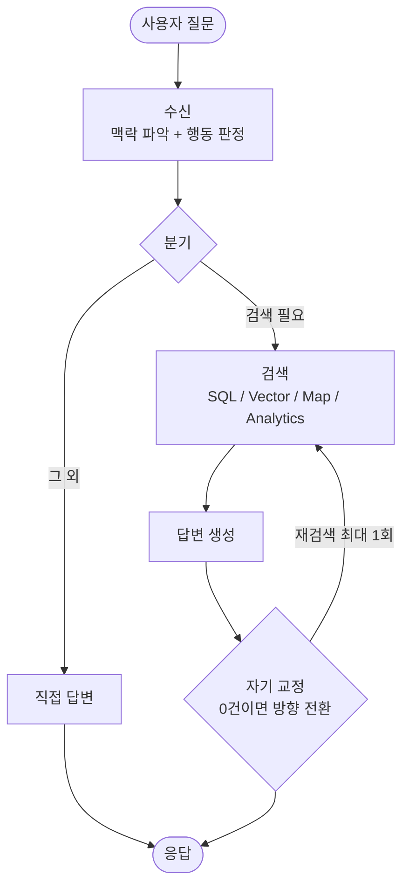

멀티에이전트. LangGraph. 도구 호출. 자기 교정 루프.

서비스를 만들면서 내가 쓰던 단어들이다. 누가 봐도 "AI 에이전트"를 만드는 중이었다. 그런데 문서에 "에이전트 오케스트레이션"이라고 적다가 문득 멈췄다. **내가 만드는 게 정말 에이전트가 맞나?**

위 질문에 대한 결론부터 말하자면 답은 "아니오"에 가까웠다. 
그 결론을 내리게 된 과정을 정리해보려 한다.

---

## 1. AI 에이전트란 무엇인가?

AI 에이전트는 단순히 질문에 답하는 도구를 넘어, 다음 특징을 가진 독립적인 프로그램이다.

- **반복적이고 독립적인 사고와 행동**: 목표를 위해 스스로 결과를 관찰하고, 접근 방식을 조정하며, 목표에 도달할 때까지 탐색과 정제를 반복한다.
- **문제 해결 능력**: 정보를 제공하는 데 그치지 않고, 목표 달성을 위한 실행 과정을 스스로 수행한다.
- **자동화**: 인간의 반복 업무를 대신해, 사람이 더 가치 있는 일에 집중할 수 있도록 해준다.

핵심은 **"스스로"** 다. 무엇을 할지, 언제 멈출지를 사람이 아니라 모델이 정한다.

---

## 2. AI 에이전트와 AI 워크플로우의 차이

둘 다 생성형 AI를 쓰지만, **제어 방식**에서 갈린다.

 ![[Pasted image 20260710004527.png]]

| | AI 워크플로우 | AI 에이전트 |
|---|---|---|
| 제어 흐름 | **결정론적** — 개발자가 각 단계를 미리 프로그래밍 | **비결정론적** — 모델이 다음 행동을 스스로 결정 |
| 단계 수 | 미리 안다 | 미리 알 수 없다 |
| 장점 | 신뢰성, 속도, 비용 효율 | 높은 자율성, 열린 문제 대응 |
| 적합한 곳 | 프로세스가 명확한 경우 | 모든 처리 흐름을 알지 못하는 경우 |

> [!tip] 쉽게 구분해보자면
> **다음 단계를 누가 정하는가?**
> 코드(조건부 분기)면 **워크플로우**, LLM이면 **에이전트**.

그렇다면 무조건 에이전트가 좋은 걸까? 
자율성은 곧 비결정성이고, 이는 디버깅 난이도, 지연, 비용으로 돌아온다. <br/> 그래서 [Anthropic](https://www.anthropic.com/engineering/building-effective-agents)에서도 권한다 — *대부분의 use case는 워크플로우로 충분하고, 에이전트는 정말 필요할 때만 써라.* 

---

## 3. 내가 만든 걸 해부해보니… 워크플로우였다

내 서비스는 LangGraph 기반의 상태 그래프로 구성돼 있다. 노드가 여러 개고, 각 노드 안에서 LLM이 돌아간다. 흐름은 대략 이렇다.



여기서 판별법을 대입해봤다. **다음 단계를 누가 정하는가?**

- 노드 사이의 전이는 그래프를 만들 때 **조건부 엣지로 미리 선언**돼 있다. 분기 함수는 상태(state)만 읽는 순수 함수다.
- LLM은 노드 **안에서** 분류하고 추출할 뿐이다. "이 질문은 검색이 필요한가", "검색 필터는 어떤 건가" 같은 판단은 하지만, **그다음 어느 노드로 갈지는 못 정한다.** 그건 코드가 정한다.

```python
# 분기 함수는 state만 읽는다. LLM이 채운 값을 "읽어" 다음 노드를 고를 뿐,
# 어디로 갈지는 코드가 정한다.
def route_intake(state) -> str:
    if state["action"] == "RETRIEVE":
        return "router"        # 검색 경로
    return "direct_answer"     # 그 외는 곧장 답변

# 전이는 그래프를 만들 때 미리 선언해 둔다 (런타임에 LLM이 정하지 않는다).
graph.add_conditional_edges("intake", route_intake)
```

즉 다음 단계를 정하는 건 **LLM이 아니라 코드**였다. 판별법대로면 이건 워크플로우다.

> [!question] "자기 교정 루프가 있잖아? 그럼 에이전트 아닌가?"
> 나도 여기서 헷갈렸다. 하지만 내 자기 교정은 **"결과가 0건이면 SQL→Vector로 바꿔 한 번 더"** 라는 **규칙**이다. 조건도, 재시도 횟수(1회)도 코드에 박혀 있다. 루프가 있다고 에이전트가 아니다. **누가 그 루프를 제어하느냐**가 기준이고, 여기선 코드다.

멀티에이전트라는 이름도 다시 보였다. 수신 / 검색 계획 / SQL / Vector / 답변… 역할별로 나눈 LLM 구성요소를 "에이전트"라 부른 것뿐, 그들이 서로 협상하거나 자율적으로 조율하지 않는다. **역할 분리 ≠ 자율성.**

---

## 4. 그럼 진짜 에이전트는 언제 쓰나?

사실 내 그래프에도 규칙 기반 자기 교정과는 다른, '관찰 → 판단' 루프가 하나 있긴 하다. 검색 결과가 부적합하거나 부족할 경우 LLM이 다시 검색할 방식을 결정하는 노드다. 그나마 가장 에이전트에 가깝다. 하지만 뜯어보면 **정해진 선택지 중 하나를 고르는, 횟수도 제한된 루프**에 불과했다.

그럼 진짜 에이전트가 빛나는 건 언제일까? **여행 플래너**를 떠올리면 쉽다.

예를 들어 "7월 마지막 주, 예산 100만 원으로 제주도" 한 줄을 던지면 에이전트는 이렇게 움직인다.

1. 항공편을 검색한다 (항공편 검색 tool 호출)
2. 남은 예산으로 갈 수 있는 숙소를 찾는다 (숙소 검색 tool 호출)
3. 합쳐서 예산을 넘으면 → 더 싼 항공편으로 되돌아가거나 날짜를 하루 민다 (항공편 검색 tool 호출)
4. 조건이 맞으면 예약까지 진행한다 (예약 tool 호출)

여기서 핵심은 **몇 번을 돌지, 어떤 순서로 무슨 도구를 쓸지 아무도 미리 못 짠다**는 것이다. "예산 초과"라는 중간 결과를 보고 모델이 다음 행동을 그때그때 정한다. 이게 에이전트다.

> [!warning] 자율성은 공짜가 아니다
> 마지막 단계인 '예약'엔 되돌리기 힘든 부수효과가 있다. 스스로 판단해 행동하는 만큼 잘못된 결정도 스스로 저지른다 — 엉뚱한 날짜를 덜컥 예약해버릴 수도 있다. 그래서 진짜 에이전트에는 승인 단계, 지출 한도, 롤백 같은 안전장치가 따라붙는다. 이렇듯 자율성은 성능인 동시에 리스크가 될 수 있는 것이다.

정리하면 에이전트는 이런 조건이 겹칠 때 값을 한다.

- 경로와 단계 수를 **미리 못 짠다** (열린 문제)
- 중간 결과를 보고 **다음 행동을 매번 새로** 정해야 한다
- 도구를 **어떤 순서로 몇 번** 쓸지 모델이 조합해야 한다

여행 플래너 말고도 코딩 에이전트(탐색→수정→테스트 반복), 딥리서치(읽고 다음 검색을 스스로 결정)가 같은 부류다. 반대로 **프로세스가 명확하고, 지연·비용에 민감하고, 재현·감사가 필요한** 일은 워크플로우가 맞다. 내 예약 안내 서비스가 정확히 여기 속한다.

---

## 5. 그래서, 무엇을 배웠나

**내가 만든 서비스의 정체**: *결정적 워크플로우이고, 에이전트적 자율성을 살짝 곁들인 정도였던 것이다.*

처음엔 이 사실이 조금 김빠졌다. "에이전트"를 만든다고 생각했으니까. 그런데 뜯어볼수록, 이게 **잘한 선택**이었다.

- **신뢰성**: 경로가 결정적이라 어떤 질문이 어디로 가는지 추적하고 테스트할 수 있다.
- **비용/지연**: 매 턴 LLM에게 "다음 뭐 할까?"를 묻지 않는다. 필요한 노드에서만 부른다.
- **디버깅**: 문제가 나면 그래프의 어느 엣지인지 짚을 수 있다. 비결정적 루프였다면 재현부터 고생했을 것이다.

그리고 자율성이 진짜 필요한 부분만 에이전트를 최소한으로 남긴 형태로 설계했다.

#### 결론
 "에이전트를 만들자"가 아니라 **"이 문제에 자율성이 필요한가?"** 를 노드 단위로 물었어야 했다. 대부분의 답은 "아니오"였고, 그래서 대부분이 워크플로우가 됐다. 최선의 선택이었던 것이다.

화려한 이름에 끌리기 전에 한 줄만 기억하자 — **지금 이 문제에 위험과 비용을 감수할 자율성이 필요한가?**
에이전트를 만들려다 워크플로우를 만들었다. 그리고 그건 실패가 아니라, 문제에 맞는 도구를 고른 결과였다.

