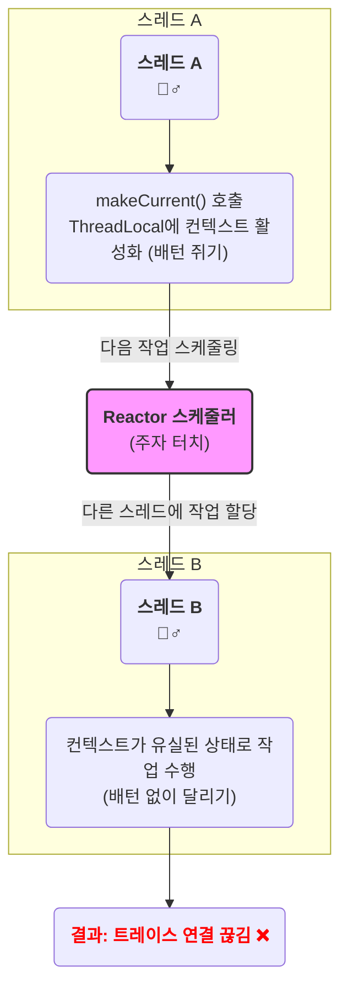

## 1. 문제 상황

리액티브(Spring WebFlux)기 어플리케이션에 OpenTelemetry를 이용해 커스텀 Span 추적 기능을 구현했으나, 다음과 같은 문제가 발생했다.

- Jaeger UI에서 `clock skew adjustment disabled` 경고가 발생하며, **종료되지 않은 Span이 매우 긴 시간 동안 이어지는 것처럼 보였다.**
    
- `spring-webflux` 계측 라이브러리가 생성해야 할 **최상위 Span이 유실**되었다.
    
- Span은 트리와 같은 형태로 이어지는데, 직접 생성한 커스텀 Span들이 부모를 잃은 **고아(Orphan) Span**이 되어 트레이스 체인이 끊어졌다.
    
기술에 대한 이해가 부족한 상황에서 도입하고 사용하려니, 또 다른 문제를 낳고 해결하는데는 생각보다 많은 시간이 소요됐다. 
## 2. 리액티브 프로그래밍의 처리 방식


### 리액티브 프로그래밍

**리액티브 프로그래밍은 데이터 흐름과 전달에 관한 프로그래밍 패러다임이다.** 어떤 기능이 직접 실행되는 것이 아니라, 시스템에 이벤트가 발생했을 때 이를 처리하는 방식이다. 네트워크 프로그래밍에서 사용하는 콜백(callback)이나 UI 프로그래밍에서 버튼 클릭 리스너가 작동하는 것도 개념상 리액티브 프로그래밍에 해당한다. 

RxJava는 이러한 개념을 **데이터 스트림(Data Stream)** 으로 구현한다. 마치 물이 흐르는 파이프처럼, 시간에 따라 발생하는 데이터나 이벤트의 흐름을 만든다. 그리고 **연산자(Operator)** 를 사용해 이 흐름을 선언적으로 제어한다. 예를 `filter()`, `map()` 처럼 데이터의 흐름을 가공하고 조합할 수 있다.

이러한 작업들은 **스케줄러(Scheduler)** 를 통해 특정 스레드에서 실행되도록 지정할 수 있다. 작업 스레드는 I/O 작업을 요청한 뒤 결과를 기다리지 않고(Non-Blocking) 즉시 다른 작업을 처리하러 이동하며, 작업이 완료되면 스트림을 통해 결과가 흘러들어와 다음 단계가 진행된다.

전통적인 블로킹 모델(예: Spring MVC)은 **요청 하나에 스레드 하나가 처음부터 끝까지 처리**한다.
반면에 리액티브 프로그래밍 에서는 **여러 스레드를 사용하여 동시에 많은 요청을 처리**하는 **논블로킹(Non-Blocking)** 방식을 사용한다.

### Reactor/RxJava에서의 스레드 관리
#### 물리적인 스레드와 논리적인 스레드

- **물리적인 스레드(Physical Thread)**
  CPU 코어가 가진 실제 실행 단위다. 하나의 코어가 두 개의 물리적 스레드를 포함하며, 이는 물리적인 코어를 논리적으로 나눈 것이다.
    
- **논리적인 스레드(Logical Thread)** 
  소프트웨어적으로 생성되는 스레드로, Java에서 사용하는 스레드 개념이다. 메모리가 허용하는 한 개수 제한 없이 생성 가능하지만 동시에 실행되는 것은 물리적인 스레드 개수 내에 제한된다.
    
즉, 많은 논리적인 스레드가 생성될 수 있지만, 실제 동시에 실행되는 스레드 수는 물리적인 스레드 수에 의해 제한된다.

#### 병렬성과 동시성

- **병렬성(Parallelism)**
  *물리적인 스레드*들이 실제로 동시에 실행되어 여러 작업을 동시에 처리하는 것이다.
    
- **동시성(Concurrency)**
  여러 *논리적인 스레드*가 번갈아 실행되면서 동시에 실행되는 것처럼 보이는 상태를 의미한다.

**Reactor와 RxJava는 이벤트를 처리하기 위해 스케줄러(Scheduler)를 사용해 작업이 실행될 스레드를 관리한다.** 스케줄러는 CPU 코어에 기반한 물리적 스레드 풀에서 논리적 스레드를 생성/운영하는 역할을 한다.

- `subscribeOn()`: 연산자는 스트림 시작 지점에서 실행할 스레드를 지정한다.
    
- `publishOn()`: 연산자는 그 이후 작업을 다른 스레드로 전환한다.
    
이 과정을 통해 **리액티브 스트림은 여러 논리적 스레드에 걸쳐 작업을 나눠 처리하게 된다.**

하지만 이처럼 자주 스레드가 전환되면서, `ThreadLocal` 기반 컨텍스트는 자동으로 전파되지 않는다. 때문에 OpenTelemetry 같은 툴은 별도의 컨텍스트 전파 메커니즘이 필요하다.

## 3. OpenTelemetry의 ThreadLocal 기반 컨텍스트

`ThreadLocal`은 특정 데이터를 **현재 스레드에만 저장**하는 공간이다. OpenTelemetry의 `span.makeCurrent()`는 이 `ThreadLocal`을 사용해 "현재 활성화된 Span은 이것이다"라고 스레드에 기록한다.

이는 마치 "릴레이 경주 주자가 손에 배턴을 쥐는 것"과 같다. 다만, 이 배턴은 해당 스레드에만 유효하고, 다음 스레드에 전달되지 않는다.

### 배턴을 든 릴레이 주자




즉, Reactive 환경에서 `span.makeCurrent()`를 호출해 ThreadLocal(배턴)을 고정한 스레드 A에서, 작업이 다른 스레드 B로 넘어가면서 ThreadLocal 정보(배턴)가 전달되지 않아 컨텍스트가 유실된다. 결과적으로 트레이스 연결이 끊기고 문제가 발생한다.

## 4. 잘못된 접근(코드 분석)

성능측정과 병목지점 분석을 위해, AI 에이전트에게 '커스텀 span을 추가 구현'하는 코드를 요청했다.
아래와 같이 `makeCurrent()`로 컨텍스트를 활성화하여 Thread-safe 한 코드를 작성하려 한 듯 하다.

`scope.close()`를 `doOnSuccess`와 `doOnError`에서 호출하여 컨텍스트를 정리하려 했지만, `scope`를 생성한 스레드와 `close()`를 호출한 스레드가 달라 효과가 없었다.
이로 인해, 스레드에 span이 컨텍스트에 남아 계속 처리중인 상태로 남아 있는 문제가 발생하게 된 것이였다.

```kotlin  
fun handle(exchange: ServerWebExchange): Mono<Void> {
    // ...
    val mySpan = tracer.spanBuilder("my-operation").startSpan()
    val scope = span.makeCurrent(); // 문제의 코드!! (메인스레드 영역)
    
    return someReactiveChain()
		// 리액터 스케줄러에서 할당한 별도의 스레드에서 처리
        .doOnSuccess {  
            filterChainSpan.addEvent("filter.chain.completed")  
            scope.close()  
        }
        .doOnError { error ->
            mySpan.recordException(error)
            mySpan.setStatus(StatusCode.ERROR)
            scope.close()             
        }
        .doFinally { 
            mySpan.end()
        }
}  
```

## 5. 해결책

`ThreadLocal`을 직접 제어하지 말고, **반응형 스트림의 생명주기에 Span 생명주기를 맞추는 것**이 해결책이다.
(`span.makeCurrent()` 코드를 제거하였다.)

span을 
```kotlin
	fun handle(exchange: ServerWebExchange): Mono<Void> {
	    // ...
	    val mySpan = tracer.spanBuilder("my-operation").startSpan()
	    
	    return someReactiveChain()
	        .doOnError { error ->
	            mySpan.recordException(error)
	            mySpan.setStatus(StatusCode.ERROR)
	        }
	        .doFinally { 
		        filterChainSpan.addEvent("filter.chain.completed")  
	            mySpan.end()
	        }
	}
	```


## 6. 결론

결국 내가 겪은 `Span` 유실과 트레이스 단절 문제는, 리액티브 프로그래밍의 동작 방식을 이해하지 못한 채 명령형 프로그래밍의 패턴을 적용했기 때문에 발생한 것이었다. 이 과정을 통해 다음과 같은 중요한 결론을 얻을 수 있었다.

- **Thread-Safe와 Reactive-Safe는 다르다.** AI가 제안했던 `makeCurrent()` 사용 패턴은 스레드 안전성(Thread-Safe)은 보장할 수 있었겠지만, 여러 스레드를 넘나드는 반응형 환경의 안전성(Reactive-Safe)까지 보장하지는 못했다.
    
- **프레임워크의 메커니즘을 신뢰해야 한다.** 리액티브 환경에서는 `ThreadLocal`을 직접 제어하려 하기보다, `opentelemetry-reactor` 라이브러리와 같이 프레임워크가 제공하는 컨텍스트 전파 메커니즘을 신뢰하고 활용하는 것이 올바른 접근법이다.
     
 기술을 도입할 때는 단순히 '어떻게 사용하는가'를 넘어 '왜 그렇게 동작하는가'에 대한 필요성을 다시 한번 깨닫게 되었다.