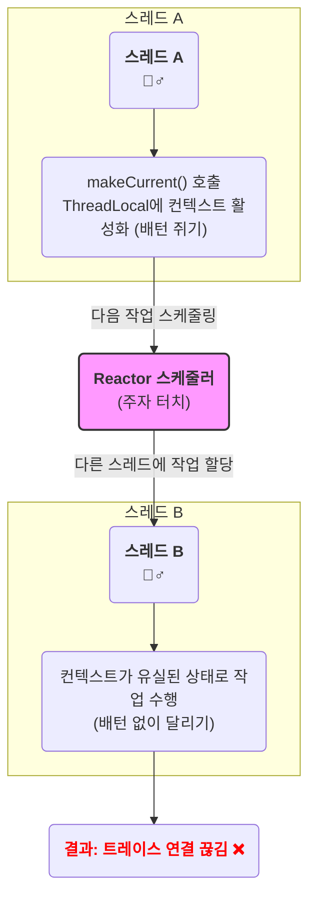

---
tags:
  - webflux
  - reactive-programming
---
## 1. 문제 상황

리액티브(Spring WebFlux) 기반의 어플리케이션에 OpenTelemetry를 이용해 커스텀 Span 추적 기능을 구현했으나, 다음과 같은 문제가 발생했다.

- Jaeger UI에서 `clock skew adjustment disabled` 경고가 발생하며, **종료되지 않은 Span이 매우 긴 시간 동안 이어지는 것처럼 보였다.**
    
- `spring-webflux` 계측 라이브러리가 생성해야 할 **최상위 Span이 유실**되었다.
    
- Span은 트리와 같은 형태로 이어지는데, 직접 생성한 커스텀 Span들이 부모 노드를 잃은 상태가 되어 트레이스 체인이 끊어졌다.
    
기술에 대한 이해가 부족한 상황에서 도입하고 사용하려니, 또 다른 문제를 낳고 해결하는데는 생각보다 많은 시간이 소요됐다. 

## 2. 문제 지점 분석

성능측정과 병목지점 분석을 위해 `makeCurrent()`로 컨텍스트를 수동 활성화하여 어디서든 Span에 접근할 수 있는 코드를 작성하려 했다.

`span.makeCurrent()`를 호출하면 해당 스레드의 `ThreadLocal`에 고정하게 된다. **문제는 내가 사용하는 리액티브 환경의 특성상 작업 도중 스레드가 수시로 바뀐다는 점**이다.

이후 `scope.close()`를 `doOnSuccess`와 `doOnError`에서 호출하여 컨텍스트를 정리하려 했지만, 효과가 없었다. 이전에 `scope`를 생성한 스레드와 `close()`를 호출한 스레드가 달랐고 컨텍스트를 유지하지 않게 `span.makeCurrent()` 를 호출하여 span에 대한 정보가 없었기 때문이다.
이로 인해, 원하는 대로 span 을 종료할 수 없었고 스레드의 span은 여전히 컨텍스트에 남아 계속 처리중인 상태로 남아 있는 문제가 발생하게 된 것이였다.

```kotlin  
fun handle(exchange: ServerWebExchange): Mono<Void> {
    // ...
    val mySpan = tracer.spanBuilder("my-operation").startSpan()
    val scope = span.makeCurrent(); // 문제의 코드!! (부모 스레드 영역)
    
    return someReactiveChain()
		// 리액터 스케줄러에서 할당한 별도의 스레드에서 처리
        .doOnSuccess {  
            mySpan.addEvent("filter.chain.completed")  
            scope.close()  
        }
        .doOnError { error ->
            mySpan.recordException(error)
            mySpan.setStatus(StatusCode.ERROR)
            scope.close()             
        }
        .doFinally { 
            mySpan.end()
        }
}  
```

### 2-1. 리액티브 프로그래밍의 처리 방식

**리액티브 프로그래밍은 데이터 흐름과 전달에 관한 프로그래밍 패러다임이다.** 어떤 기능이 직접 실행되는 것이 아니라, 시스템에 이벤트가 발생했을 때 이를 처리하는 방식이다. 네트워크 프로그래밍에서 사용하는 콜백(callback)이나 UI 프로그래밍에서 버튼 클릭 리스너가 작동하는 것도 개념상 리액티브 프로그래밍에 해당한다. 

RxJava는 이러한 개념을 **데이터 스트림(Data Stream)** 으로 구현한다. 마치 물이 흐르는 파이프처럼, 시간에 따라 발생하는 데이터나 이벤트의 흐름을 만든다. 그리고 **연산자(Operator)** 를 사용해 이 흐름을 선언적으로 제어한다. 예를 `filter()`, `map()` 처럼 데이터의 흐름을 가공하고 조합할 수 있다.

이러한 작업들은 **스케줄러(Scheduler)** 를 통해 특정 스레드에서 실행되도록 지정할 수 있다. 작업 스레드는 I/O 작업을 요청한 뒤 결과를 기다리지 않고(Non-Blocking) 즉시 다른 작업을 처리하러 이동하며, 작업이 완료되면 스트림을 통해 결과가 흘러들어와 다음 단계가 진행된다.

전통적인 블로킹 모델(예: Spring MVC)은 **요청 하나에 스레드 하나가 처음부터 끝까지 처리**한다.
반면에 리액티브 프로그래밍 에서는 **여러 스레드를 사용하여 동시에 많은 요청을 처리**하는 **논블로킹(Non-Blocking)** 방식을 사용한다.

**Reactor와 RxJava는 이벤트를 처리하기 위해 스케줄러(Scheduler)를 사용해 작업이 실행될 스레드를 관리한다.** 스케줄러는 CPU 코어에 기반한 물리적 스레드 풀에서 논리적 스레드를 생성/운영하는 역할을 한다.

- `subscribeOn()` 
	- 스트림 시작 지점에서 실행할 스레드를 지정한다.
    
- `publishOn()`
	- 그 이후 작업을 다른 스레드로 전환한다.
    
이 과정을 통해 **리액티브 스트림은 여러 논리적 스레드에 걸쳐 작업을 나눠 처리하게 된다.**

> 이처럼 자주 스레드가 전환되면서, `ThreadLocal` 기반 컨텍스트는 자동으로 전파되지 않는다. 때문에 OpenTelemetry 같은 툴은 별도의 컨텍스트 전파 메커니즘이 필요하다.

### 2-2.OpenTelemetry의 ThreadLocal 기반 컨텍스트

`ThreadLocal`은 데이터를 **현재 실행 중인 특정 스레드에만 저장**하는 독립적인 공간이다. OpenTelemetry의 `span.makeCurrent()`는 이 *`ThreadLocal`을 사용해 현재 활성화된 Span을 스레드에 기록*한다.
이를 통해 개발자는 메서드마다 Span 인자를 일일이 넘기지 않아도 `Span.current()`를 통해 손쉽게 트레이스 정보를 활용할 수 있게된다.
#### 배턴을 든 릴레이 주자
> 리액티브 환경에서 `span.makeCurrent()`를 호출해 ThreadLocal(배턴)을 고정한 스레드 A에서 작업이 다른 스레드 B로 넘어가면서  Span 정보가 전달되지 않아 컨텍스트가 유실된다. 결과적으로 트레이스 연결이 끊기고 문제가 발생한다.
> 심지어 스레드 A는 경주가 끝났어도 배턴을 쥐고있게 되는 상황이 발생한다. 




## 3. 해결책

`ThreadLocal`을 직접 제어하지 말고, **반응형 스트림의 생명주기에 Span 생명주기를 맞추는 것**이 해결책이었다. 

`span.makeCurrent()` 코드를 제거하는 대신, Reactor에서 제공하는 스트림 연산자인 `doOnError`와 `doFinally`를 사용하여 Span에 정보를 추가하고 종료 처리한다.

```kotlin
	fun handle(exchange: ServerWebExchange): Mono<Void> {
	    // span 생성 및 시작
	    val mySpan = tracer.spanBuilder("my-operation").startSpan()
	    
	    return someReactiveChain()
		    // 에러 정보 기록
	        .doOnError { error ->
	            mySpan.recordException(error)
	            mySpan.setStatus(StatusCode.ERROR)
	        }
	        // 스트림 종료 처리 
	        .doFinally {
		        mySpan.addEvent("filter.chain.completed")  
	            mySpan.end()
	        }
	}
```

## 6. 결론

결국 내가 겪은 `Span` 유실과 트레이스 단절 문제는, *리액티브 프로그래밍의 동작 방식과 라이브러리의 매커니즘을 제대로 이해하지 못한 채 사용했기 때문에 발생*한 것이었다. 이 과정을 통해 아래의 내용을 배울 수 있었다.

- **Thread-Safe와 Reactive-Safe는 다르다.** AI가 제안했던 `makeCurrent()` 사용 패턴은 스레드 안전성(Thread-Safe)은 보장할 수 있었겠지만, 여러 스레드를 넘나드는 반응형 환경의 안전성(Reactive-Safe)까지 보장하지는 못했다.
    
- **프레임워크의 메커니즘을 신뢰해야 한다.** 리액티브 환경에서는 `ThreadLocal`을 직접 제어하려 하기보다, `opentelemetry-reactor` 라이브러리에서 제공하는 컨텍스트 전파 메커니즘을 신뢰하고 활용하는 것이 올바른 접근법이다.
     
 기술을 도입하고 사용할 때 '어떻게 사용하는가'보다 '왜 그렇게 동작하는가'에 대한 이해의 필요성을 다시 한번 깨닫게 되었다.